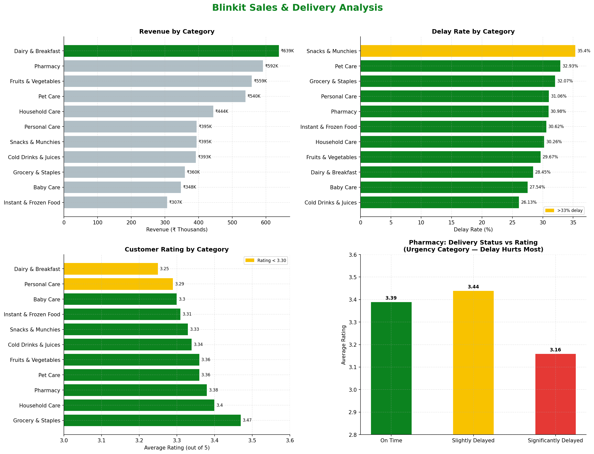

# Blinkit Sales & Delivery Analysis

An end-to-end data analysis project exploring sales performance, delivery efficiency,
and customer satisfaction across product categories on Blinkit — India's quick commerce platform.

---

## Business Questions
- Which product categories generate the most revenue?
- Does delivery delay affect customer ratings?
- Are all categories equally sensitive to late deliveries?

---

## Dataset
**Source:** [Kaggle — Blinkit Sales Dataset](https://www.kaggle.com/datasets/akxiit/blinkit-sales-dataset)

| Table | Rows |
|---|---|
| Orders | 5,000 |
| Order Items | 5,000 |
| Customers | 2,500 |
| Products | 268 |
| Customer Feedback | 5,000 |
| Delivery Performance | 5,000 |
| Inventory | 75,172 |
| Marketing Performance | 5,400 |

---

## Tools & Stack
- **Python** — pandas, matplotlib, sqlite3
- **SQL** — SQLite (9-table relational database built from CSVs)

---

## Key Findings

### 1. Dairy & Breakfast leads revenue but has the worst customer ratings
- Highest revenue category at ₹6.39L across 566 orders
- Lowest average rating at 3.25/5 — even on-time deliveries score only 3.21
- Problem is not logistics — it's freshness and quality expectations

### 2. Delivery delays don't hurt ratings overall — but Pharmacy is the exception
- Across all categories: on-time and significantly delayed orders both average 3.33
- Pharmacy drops from 3.39 (on-time) → 3.16 (significantly delayed) — a 7% fall
- Customers tolerate delays for impulse purchases but not for urgent needs

### 3. Snacks & Munchies has the highest delay rate (35.4%) with zero rating impact
- Most delay-tolerant category on the platform
- Useful lever for Blinkit to rebalance delivery partner load without hurting satisfaction

---

## Visualizations



---

## Recommendations
1. **Fix Dairy & Breakfast** — top revenue, worst satisfaction. Invest in cold-chain SLAs and freshness guarantees
2. **Protect Pharmacy fulfilment** — high revenue + high delay sensitivity = direct business risk
3. **Use Snacks as a buffer** — lowest delay sensitivity makes it ideal for absorbing delivery pressure during peak hours

---

## How to Run

```bash
pip install pandas matplotlib
python setup_db.py      # loads CSVs into SQLite
python analysis.py      # runs SQL queries
python charts.py        # generates visualizations
```

---

## Project Structure
```
blinkit-sales-analysis/
├── data/                  # raw CSVs (not tracked)
├── setup_db.py            # database setup
├── analysis.py            # SQL queries + EDA
├── charts.py              # visualizations
├── blinkit_analysis.png   # output chart
└── README.md
```
